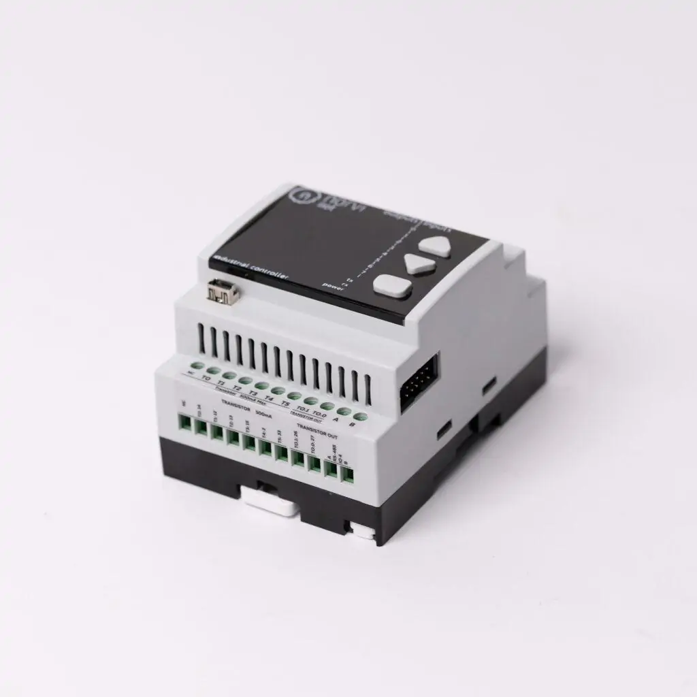

Project Overview 🌐
===

This project connects a NORVI ESP32 microcontroller to WiFi and an MQTT broker.

Data is published to a topic based on MAC address and handled by a MQTT (Mosquitto)/Flask backend
that stores it in SQLite.

The firmware 🕹️ code is written in **Rust** using the *Embassy* framework, which is `async` and `no-std`, while the
backend is written in *Python* with **Flask** and **SQLite**.

Backend code is minimalist and portable
by leveraging `docker compose` for easy, cloud-native ☁️ deployment.
is:issue state:open

**Code repositories:**

- [ESP32 firmware repository](https://github.com/simlal/norvi-esp32-gateway-mqtt)
- [Frontend/backend/database repository](https://github.com/simlal/mqttbroker-sqlite-flask_minimalist-stack)
<!-- end_slide -->

Why Rust and Embassy? 🦀⚡
===

# Embassy

[Embassy](https://embassy.dev/) is an async, no-std embedded framework for Rust. It brings async/await
to microcontrollers with excellent performance and memory safety.

- It works with `esp-hal`, making it ideal for WiFi-capable boards like the ESP32.
- Has support for timers, data structures, and async tasks.

# Rust

- Memory safe + strong type system, thus ⬇️ bugs.
- Excellent performance ⚡, comparable to C/C++.

<!-- end_slide -->

IoT Architecture 🌐
===

# Overview

Architecture is split up into two main components:

- Hardware (ESP32) 🛠️
- Backend (Mosquitto + Flask + SQLite) as a single managed `docker-compose.yaml` 🐳 in containers 🗄️

By leveraging both [Embassy](https://embassy.dev/) and [Docker](https://www.docker.com/), we can create a simple yet fully-fledged and vendor agnostic solution.

Next slide for a diagram of the architecture:

<!-- end_slide -->

IoT Architecture 🌐
===

```text
                           +-------------+     WiFi     +---------------+     WiFi     
                           | ESP32 Device | ----------> | ESP32 Gateway | -------+     
                           +-------------+              +---------------+       |     
                                                                               |     
                                                                               v     
                        +----------------------------------------------------------+
                        |                     Docker Compose Network               |
                        |  +-------------------+        +----------------------+   |
                        |  | MQTT Broker       | <----> | Flask Application    |   |
                        |  | (Mosquitto)       |        | +-----------------+  |   |
                        |  +-------------------+        | | Web Interface   |  |   |
                        |                               | | (Templates)     |  |   |
                        |                               | +-----------------+  |   |
                        |                               |         ^            |   |
                        |                               |         |            |   |
                        |                               |         v            |   |
                        |                               | +-----------------+  |   |
                        |                               | | API Endpoints   |  |   |
                        |                               | +-----------------+  |   |
                        |                               |         ^            |   |
                        |                               |         |            |   |
                        |                               |         v            |   |
                        |  +-------------------+        | +-----------------+  |   |
                        |  | SQLite Database   | <----> | | Data Processing |  |   |
                        |  +-------------------+        | +-----------------+  |   |
                        |                               +----------------------+   |
                        +----------------------------------------------------------+
```

<!-- end_slide -->

IoT Architecture 🌐
===

# Novelty and Benefits

## On hardware side

- **Rust** 🦀: Memory safe, async, no-std, and high performance.
- **Embassy** ⚡: Scheduler without RTOS overhead, vendor agnostic (compatibility)

## On backend side

Based on all open-source software and ready for any cloud provider or on-premise deployment.

- **MQTT** 📡: Lightweight pub/sub messaging protocol ideal for constrained IoT devices
- **Containerization** 🐳: Modular, portable deployment across environments
- **Flask** 🌶️: Lightweight API + dashboard and CRUD operations in a single framework
- **SQLite** 🗃️: Zero-configuration database perfect for edge deployments
- **Decoupled Design** 🧩: Message broker separates device communication from logic

<!-- end_slide -->

IoT Architecture 🌐
===

# Communication Protocols

## 1. On MCU Side 🔌

- **WiFi (802.11)** 📶: Connects ESP32 devices to network infrastructure
- **SPI** 🧠: Communication with the onboard OLED display

### *Not implemented yet (OPTIONAL)*

- **ESP-NOW** 🔄: P2P wireless communication
- **I2C** 📊: Interface for potential sensor expansion

## 2. Gateway and Backend 🌐

- **MQTT** 📡: Main communication protocol between ESP32 and backend (and itself)
  - Topic structure: i.e. `/readings/gateway/{MAC_ADDRESS}`
  - JSON payloads with device data (RSSI, timestamps)
  - `QoS 0` for efficient, lightweight transmission

## Backend Services 🖥️

- **REST API** 🔗: Flask endpoints for CRUD operations
- **HTTP** 🌐: Web interface for monitoring and visualization
- **SQLite Queries** 🗃️: File-based database access (no TCP/network protocol required)
- **Docker Network** 🔄: Inter-container communication using Docker's built-in DNS resolution and bridge networking

<!-- end_slide -->

Hardware 🔩
===

Simple setup with NORVI ESP32 and OLED display



# Hardware Needed

- ESP32-WROOM (NORVI) with OLED  
- 12V DC supply  
- *OPTIONAL*: Additional ESP32s for ESP-NOW mesh

<!-- end_slide -->

Setup: firmware side 🛠️
===

# Tools Needed 🧑‍💻

- Rust + Cargo installed
- `espup` and `espflash` (Espressif tools for flashing and managing ESP32 devices)
- `esp` toolchain
- WiFi Connection (SSID and password)
- User in dialout group (Linux) for flashing
- *OPTIONAL*: Digital temperature probe and other

**You can verify this by running:**

```bash +exec
# Verify cargo/rust installation and esp toolchains
cargo --version
rustup toolchain list | rg esp
espflash --version

# Add dialout group if not present or use sg dialout on build
groups $USER
```

<!-- end_slide -->

Setup: firmware side 🛠️
===

# Setup Steps ✅

```bash
cargo install espup espflash
git clone git@github.com:simlal/norvi-esp32-gateway-mqtt.git
cd norvi-esp32-gateway-mqtt
source export-esp.sh
```

Edit `.cargo/config.toml`:

```bash
[env]
ESP_LOG = "DEBUG"
SSID = "YourWifiSSID"
```

---

# Build and flash the code 🚀

First, plugin the esp via serial (micro-usb) and flash the code to the ESP32:

```bash
SSID_PASSWORD='YourVerySecurePassword' sg dialout -c \
  "cargo run --bin main_gateway --release"
```

<!-- end_slide -->

Hardware Initialization 🔌
===

Before `main` loop:

1. Setup the hardware
2. Spawns the wifi and display refresh asynchronous tasks.
3. Makes the initial connection to the WiFi network and first refresh
4. Runs the main loop

CPU is free to do other tasks while waiting for the display to refresh.

Here is an example from the `display.rs` module:

<!-- end_slide -->

```rust

#[embassy_executor::task]
pub async fn connection_task(
    mut controller: WifiController<'static>,
    ssid: &'static str,
    ssid_password: &'static str,
) {
    'start_conn_loop: loop {
        if !matches!(controller.is_started(), Ok(true)) {
            let client_config = Configuration::Client(ClientConfiguration {
                ssid: ssid.try_into().unwrap(),
                password: ssid_password.try_into().unwrap(),
                ..Default::default()
            });
            controller.set_configuration(&client_config).unwrap();
            info!("Starting WiFi...");
            controller.start_async().await.unwrap();
        }

        info!("Attempting connection...");
        match controller.connect_async().await {
            Ok(_) => info!("Connected!"),
            Err(e) => {
                warn!("Connection failed: {e:?}");
                info!("Retrying in 5 secs...");
                Timer::after(Duration::from_secs(5)).await;
                continue 'start_conn_loop;
            }
        }
        // Main polling loop while connected
        'poll_rssi_when_conn: while esp_wifi::wifi::wifi_state() == WifiState::StaConnected {
            if let Ok(scan_res) = controller.scan_n::<10>() {
                for ap in scan_res.0 {
                    // HACK: N=10 is arbitrary, in my case I scan current conn SSID twice
                    if ap.ssid == ssid {
                        let rssi = ap.signal_strength;
                        CURRENT_RSSI.store(rssi, Ordering::Relaxed);
                        info!(
                            "Updated RSSI for '{}': {} dBm, channel={}",
                            ssid, rssi, ap.channel
                        );
                    }
                }
            }

            Timer::after(Duration::from_secs(10)).await;
            if esp_wifi::wifi::wifi_state() == WifiState::StaDisconnected {
                warn!("WiFi Disconnected! Restarting connection...");
                Timer::after(Duration::from_secs(5)).await;
                break 'poll_rssi_when_conn; // Exit loop to retry connection
            }
        }
    }
}
```

<!-- end_slide -->

Hardware Initialization 🔌
===

# Initialization Logs

```
INFO - Initialized hardware and allocated 72 KB of pre-defined heap
INFO - Embassy initialized!
INFO - Initialized display device, spawning task with ~5s refresh.
INFO - esp-wifi configuration EspWifiConfig { rx_queue_size: 5, tx_queue_size: 3, static_rx_buf_num: 10, dynamic_rx_buf_num: 32, static_tx_buf_num: 0, dynamic_tx_buf_num: 32, ampdu_rx_enable: true, ampdu_tx_enable: true, amsdu_tx_enable: false, rx_ba_win: 6, max_burst_size: 1, country_code: "CN", country_code_operating_class: 0, mtu: 1492, tick_rate_hz: 100, listen_interval: 3, beacon_timeout: 6, ap_beacon_timeout: 300, failure_retry_cnt: 1, scan_method: 0 }
INFO - STA device and controller init OK.
INFO - mac address for gateway: 3C:E9:0E:72:12:4C
INFO - Spawning connection and network stack tasks...
INFO - Waiting for link to be up
WARN - esp_wifi_internal_tx 12290
INFO - Start connection task
INFO - Device capabilities: Ok(EnumSet(Client))
INFO - Starting WiFi...
INFO - Attempting connection...
INFO - Connected!
INFO - Updated RSSI for 'bike_maniacs': -50 dBm, channel=9
INFO - Updated RSSI for 'bike_maniacs': -63 dBm, channel=9
INFO - Waiting to get IP address...
INFO - Got IP: 192.168.68.105/24
INFO - Connection to Wifi 'bike_maniacs' successfull!
INFO - All configs init and setup completed!
```

<!-- end_slide -->

Gateway Main loop 🔄
===

Main loop runs the main task: Wifi signal strength (RSSI) scanning, polling connection and publishing to MQTT broker.

# Logs

## Connection log

```bash
INFO - Connecting to MQTT broker at 192.168.68.108:1883...
INFO - connected!
INFO - Connected to broker!
INFO - Raw RSSI value: -51 dBm
INFO - Current rssi%: 65
# RSSI Updates every 10s (This is where we could send temperature data from other MCUs)
INFO - Updated RSSI for 'bike_maniacs': -52 dBm, channel=9
```

## Payload log

```bash
INFO - Publishing data: {"macAddress":"3C:E9:0E:72:12:4C", "timestamp":93387, "rssi":65}
INFO - Successfully sent payload to broker on topic=/readings/gateway/3C:E9:0E:72:12:4C
```

<!-- end_slide -->

Gateway Main loop 🔄
===

# Before main loop

```rust
#[esp_hal_embassy::main]
async fn main(spawner: Spawner) {
    // ...
    let mac = sta_device.mac_address();
    let mac_addr_hex = alloc::format!(
        "{:02X}:{:02X}:{:02X}:{:02X}:{:02X}:{:02X}",
        mac[0],
        mac[1],
        mac[2],
        mac[3],
        mac[4],
        mac[5]
    );
    info!("mac address for gateway: {}", &mac_addr_hex);

    // Spawn wifi connection tasks to poll for conn and wait for conn
    info!("Spawning connection and network stack tasks...");
    let (stack, runner) = embassy_net::new(
        sta_device,
        config,
        mk_static!(StackResources<3>, StackResources::<3>::new()),
        net_seed,
    );
    spawner
        .spawn(connection_task(sta_controller, SSID, SSID_PASSWORD))
        .unwrap();
    spawner.spawn(net_task(runner)).unwrap();

    wait_for_connection(stack).await;
    info!("Connection to Wifi '{}' successfull!", SSID);
}
```

<!-- end_slide -->

Gateway Main loop 🔄
===

# Polling rate

Then we reserve some space for transmit/receive buffers and run the main loop every 30s:

```rust
    let mut rx_buffer = [0; 4096];
    let mut tx_buffer = [0; 4096];
    let mqtt_poll_tick = Duration::from_secs(30);
    let mut mqtt_ticker = Ticker::every(mqtt_poll_tick);

    loop {...}
```

# Connect to TCP socket

```rust
let mut socket = TcpSocket::new(stack, &mut rx_buffer, &mut tx_buffer);
socket.set_timeout(Some(embassy_time::Duration::from_secs(10)));

// FIX:REFACTOR TO NOT hardcoded IP of host machine where Docker is running
let host_ip = embassy_net::Ipv4Address::new(192, 168, 68, 108);
let address = embassy_net::IpAddress::Ipv4(host_ip);

info!("Connecting to MQTT broker at {}:1883...", address);

let remote_endpoint = (address, 1883);
let connection = socket.connect(remote_endpoint).await;
if let Err(e) = connection {
    error!(
        "connect error: {:?}. Retrying in {}s",
        e,
        mqtt_poll_tick.as_secs()
    );
    continue;
}
info!("connected!");
```

<!-- end_slide -->

Gateway Main loop 🔄
===

# Connect to MQTT Broker

```rust
match client.connect_to_broker().await {
    Ok(()) => {
        info!("Connected to broker!");
        CURRENT_MQTT.store(1, Ordering::Relaxed);
    }
    Err(mqtt_error) => match mqtt_error {
        ReasonCode::NetworkError => {
            error!(
                "MQTT Network Error. Retrying in {}s",
                mqtt_poll_tick.as_secs()
            );
            CURRENT_MQTT.store(90, Ordering::Relaxed);
            continue;
        }
        _ => {
            error!(
                "Other MQTT Error: {:?}. Retrying in {}s",
                mqtt_error,
                mqtt_poll_tick.as_secs()
            );
            CURRENT_MQTT.store(91, Ordering::Relaxed);
            continue;
        }
    },
}

```

<!-- end_slide -->

Gateway Main loop 🔄
===

# Finally we publish the data to the MQTT broker

```rust
    // Get the MAC and make the topic from it
    let topic = alloc::format!("/readings/gateway/{}", mac_addr_hex);

    // Get the rssi data from the gateway
    let raw_rssi = CURRENT_RSSI.load(Ordering::Relaxed);
    info!("Raw RSSI value: {} dBm", raw_rssi);
    let rssi = approx_rssi_to_percent(&CURRENT_RSSI);
    info!("Current rssi%: {}", rssi);

    // HACK: Create a simple timestamp using uptime, we format it in flask app for now
    let uptime_ms = embassy_time::Instant::now().as_millis();
    let mut data_str: String<128> = String::new(); // Increased size for JSON data

    write!(
        data_str,
        "{{\"macAddress\":\"{}\", \"timestamp\":{}, \"rssi\":{:.2}}}",
        mac_addr_hex, uptime_ms, rssi
    )
    .expect("write! failed!");
    info!("Publishing data: {}", data_str);

    match client
        .send_message(
            &topic,
            data_str.as_bytes(),
            rust_mqtt::packet::v5::publish_packet::QualityOfService::QoS1,
            true,
        )
        .await
    {
        Ok(()) => {
            info!("Successfully sent payload to broker on topic={}", &topic)
        }
        Err(mqtt_error) => match mqtt_error {
            ReasonCode::NetworkError => {
                error!(
                    "MQTT Network Error. Retrying in {}s",
                    mqtt_poll_tick.as_secs()
                );
                CURRENT_MQTT.store(90, Ordering::Relaxed);
                continue;
            }
            _ => {
                error!(
                    "Other MQTT Error: {:?}. Retrying in {}s",
                    mqtt_error,
                    mqtt_poll_tick.as_secs()
                );
                CURRENT_MQTT.store(90, Ordering::Relaxed);
                continue;
            }
        },
    }
}
```

<!-- end_slide -->

Demo: Display Refresh & WiFi Connection 📱
===

Short demo showing the ESP32 display refreshing with WiFi and MQTT status:

- The OLED display updates every ~5 seconds ⏱️
- Shows current WiFi signal strength (RSSI) 📶
- Indicates MQTT broker connection status 🔌
- Real-time feedback for troubleshooting in the field 🔍

```bash +exec
xdg-open ./media/display_reconnect.mp4
```

<!-- end_slide -->

Data processing and storage on the backend 🗄️
===

Backend has a much simpler architecture, with a single `docker-compose.yaml` file that
contains all the services needed to run the MQTT broker, handle the data and serve the web interface.

## Docker Compose Architecture 🐳

Simplified `compose.yaml` file:

```yaml
services:
  mqtt:        # Message Broker 📡
    image: eclipse-mosquitto:2
  
  db:          # Database 🗃️
    build: Dockerfile.sqlite
    volumes:
      - ./data:/db
  
  web:         # Flask Application 🌶️
    build: Dockerfile.flask
    depends_on: [mqtt, db]
```

- **Single YAML file** 📄 defines entire infrastructure
- **Shared volumes** 💾 for persistent database storage
- **Automatic networking** 🔌 between containers using Docker's built-in DNS resolution
- **Dependency management** ⛓️ ensures proper startup order

<!-- end_slide -->

Data flow pipeline 📈
===

Since the backend is a single `docker-compose.yaml` file, the data flow is simple and can run on any machine with a **Docker** engine:

1. MQTT broker receives messages from ESP32 devices
2. Flask application subscribes to MQTT topics
3. Incoming data processed and validated
4. Clean data stored in SQLite database
5. Web dashboard visualizes the data

<!-- end_slide -->

Configure the services 🛠️
===

## Mosquitto MQTT Broker

Simple config for the MQTT Broker, but could be improved for security and persistence:

```conf
# Allow clients to connect without authentication
allow_anonymous true

# Disable persistence (optional, good for dev)
persistence false

# Default listener on port 1883
listener 1883
```

<!-- end_slide -->

Configure the services 🛠️
===

## Flask app

```python

# Base configuration
LOG_LEVEL = os.environ.get("LOG_LEVEL", "DEBUG")

# MQTT configuration
MQTT_BROKER_URL = os.environ.get("MQTT_BROKER_URL", "broker.hivemq.com")
MQTT_BROKER_PORT = int(os.environ.get("MQTT_BROKER_PORT", 1883))
MQTT_USERNAME = os.environ.get("MQTT_USERNAME", "")
MQTT_PASSWORD = os.environ.get("MQTT_PASSWORD", "")
MQTT_KEEPALIVE = int(os.environ.get("MQTT_KEEPALIVE", 5))
MQTT_TLS_ENABLED = os.environ.get("MQTT_TLS_ENABLED", "False").lower() == "true"
# MQTT topics
MQTT_BASE_TOPIC = os.environ.get("MQTT_BASE_TOPIC", "/readings")
MQTT_GATEWAY_TOPIC = f"{MQTT_BASE_TOPIC}/gateway"
MQTT_TEMPERATURE_TOPIC = f"{MQTT_BASE_TOPIC}/temperature"

# Server configuration
HOST_URL = os.environ.get("HOST_URL", "0.0.0.0")
PORT = int(os.environ.get("PORT", 5000))
DEBUG_MODE = os.environ.get("DEBUG_MODE", "ON").lower() == "on"

# Database configuration
BASE_DIR = Path(__file__).resolve().parent
DATABASE_PATH = os.environ.get("DATABASE", str(BASE_DIR / "../data/db.sqlite"))
```

<!-- end_slide -->

Database schema 🗃️
===

Simple database schema with a devices and separate readings for each device types. Here we Initialize the devices but we could make use a topic to register new devices

```sql
CREATE TABLE sensor_temperature_readings (
    id INTEGER PRIMARY KEY AUTOINCREMENT,
    device_id INTEGER REFERENCES devices(id),
    timestamp DATETIME DEFAULT CURRENT_TIMESTAMP,
    temperature REAL NOT NULL,
    received_time DATETIME DEFAULT CURRENT_TIMESTAMP
);
CREATE TABLE gateway_readings (
    id INTEGER PRIMARY KEY AUTOINCREMENT,
    device_id INTEGER REFERENCES devices(id),
    timestamp DATETIME DEFAULT CURRENT_TIMESTAMP,
    rssi INTEGER NOT NULL,
    received_time DATETIME DEFAULT CURRENT_TIMESTAMP
);
CREATE TABLE devices (
    id INTEGER PRIMARY KEY AUTOINCREMENT,
    internal_id INTEGER NOT NULL,
    mac_address TEXT NOT NULL UNIQUE,
    chip TEXT CHECK(chip IN ('ESP32-WROOM', 'ESP32-WROOM-32D')) NOT NULL,
    info TEXT,
    created_at TIMESTAMP DEFAULT CURRENT_TIMESTAMP
);
-- insert devices used for project
INSERT INTO devices (internal_id, mac_address, chip, info) VALUES (0, '3C:E9:0E:72:12:4C', 'ESP32-WROOM', 'NORVI_IIOT_GATEWAY');
INSERT INTO devices (internal_id, mac_address, chip, info) VALUES (4, '40:91:51:CB:A4:64', 'ESP32-WROOM-32D', 'MESH_TEMPERATURE_SENSOR_1');
INSERT INTO devices (internal_id, mac_address, chip, info) VALUES (6, 'E0:5A:1B:30:B3:38', 'ESP32-WROOM-32D', 'MESH_TEMPERATURE_SENSOR_2');
```

<!-- end_slide -->

Flask Application Architecture 🌶️
===

## Main Components

- **MQTT Client Integration** 📡: Connects to broker and processes incoming device messages
- **Data Processing Layer** ⚙️: Validates and transforms data before storage
- **REST API Endpoints** 🔌: Provides programmatic access to device data
- **Web Dashboard** 📊: Visualizes gateway and temperature readings

## Key Features

- **Topic-based Routing**: Messages processed based on MQTT topic patterns
- **Data Validation**: Robust error handling for device payloads
- **Device Management**: MAC address-based device identification
- **Timestamp Processing**: Handles device or server-generated timestamps

<!-- end_slide -->

Flask Application Data Flow 📊
===

## 1. Message Reception & Processing

```python
@mqtt_client.on_message()
def handle_mqtt_message(client, userdata, message):
    with app.app_context():
        try:
            payload = message.payload.decode()
            data = json.loads(payload)
            
            if MQTT_GATEWAY_TOPIC in message.topic:
                # Handle gateway RSSI data
                data["timestamp"] = datetime.now().strftime("%Y-%m-%d %H:%M:%S")
                processed_message = process_gateway_data(data)
            elif MQTT_TEMPERATURE_TOPIC in message.topic:
                # Handle temperature sensor data
                processed_message = process_sensor_temp_data(data)
```

## 2. Database Operations

- **SQLite Connection Pool**: Efficient connection management with Flask g object
- **Query Builder**: Dynamic SQL generation based on request parameters
- **Transaction Management**: Automatic commits for data modification operations

<!-- end_slide -->

Web Interface & API Endpoints 🖥️
===

## Frontend Routes

- **`/`**: Home page and system overview
- **`/gateway-readings`**: View and filter gateway RSSI data
- **`/sensor-temperature-readings`**: View and filter temperature data
- **`/devices`**: List and manage registered devices

## API Endpoints

- **`/api/devices`**: Get all registered devices
- **`/api/gateway-readings`**: CRUD operations for gateway data
- **`/api/sensor-temperature-readings`**: CRUD operations for temperature data
- **`/api/publish-*-test`**: Test endpoints to generate sample MQTT messages

## Testing Features

The application includes built-in test endpoints to simulate device data:

```python
@app.route("/api/publish-temperature-test", methods=["POST"])
def publish_temperature_test():
    data = {"macAddress": "E0:5A:1B:30:B3:38", 
            "timestamp": datetime.now().strftime("%Y-%m-%d %H:%M:%S"), 
            "temperature": random.uniform(15, 25)}
    # Publish to MQTT topic for processing
```

<!-- end_slide -->

Pre-recorded Demo 🚀: Gateway + Docker compose in action
===

1. ESP32 setup, connects to wifi
2. Try to connect to offline MQTT broker, retries
3. Docker compose services start:
    - Mosquitto broker
    - Flask app (server listens on port 5000, subscribes to MQTT topics)
    - SQLite database (initialize schema if not present)
4. ESP32 connects to MQTT broker
5. ESP32 publishes data to MQTT broker
6. Broker receives data and publishes to Flask app
7. Flask app processes data via one of its endpoints
8. Data is stored in SQLite database
9. Flask app continuously listens for new data and requests for dashboard

```bash +exec
xdg-open ./media/demo_reconnect.mp4
```

<!-- end_slide -->

Current Limitations 🚧
===

## Hardware Constraints

- **Power Management** 🔋: No deep sleep implementation yet
- **Limited Sensors** 📊: Currently only tracking WiFi signal strength
- **Security** 🔒: ESP32 firmware uses hardcoded WiFi credentials
- **Clock Synchronization** ⏰: Relies on uptime timestamps rather than RTC

## Software Limitations

- **Authentication** 👤: MQTT broker and Flask app lack user authentication
- **Scalability** 📈: SQLite may become a bottleneck with many devices
- **Monitoring** 📉: No health checks or automatic recovery system
- **Development** 🛠️: Firmware updates require physical access to ESP32 (No OTA)

The real value of this project is in the **modularity** and **portability** of the code, which can be adapted to easily integrate new sensor data and deploy on any linux machine.

<!-- end_slide -->

Future Perspectives 🔮
===

## Short-term Improvements

- **OTA Updates** 📡: Implement over-the-air firmware updates
- **Mesh Network** 🕸️: Deploy multiple ESP32s in ESP-NOW mesh for extended range
- **Sensor Expansion** 🌡️: Add temperature, humidity and other environmental sensors
- **Security Enhancements** 🔐: TLS for MQTT, secure credentials storage

I really wish I had time to explore the sensor mesh feature with the ESP-NOW protocol, which would add another layer of complexity and make the project even more interesting and usefull.

<!-- end_slide -->

Thank you! 🙏
===

Questions?

<!-- end_slide -->
